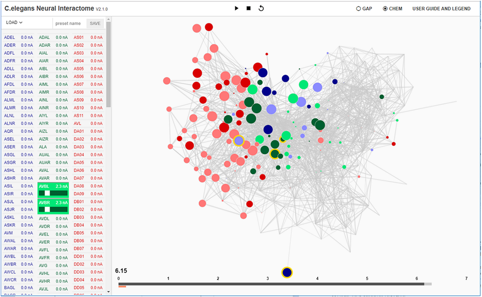

# C. elegans Neural Interactome Beta

### Beta Version: The current release of C. elegans Neural Interactome is in Beta, meaning that it is subject to restructuring, renaming, and overall general changes. We thus recommend to check the repository and clone frequently whenever there is an update.

# Introduction

C. elegans Neural Interactome is an interactive simulation platform for the neuronal network of Caenorhabditis elegans worm. It incorporates both static connectome and dynamic biophysical processes to simulate/visualize the network dynamics and allow users to interact with the network in real-time via stimuli injection/network modification. For more detailed information about the software, please refer to the [pre-print of our paper in BioRxiv](https://www.biorxiv.org/content/early/2017/11/26/209155).

# Web Interface
Web service running the latest version of Neural Interactome is available at: 

> http://neuralcode.amath.washington.edu/neuralinteractome

# Installation (Windows)

We recommend you to install [Windows Anaconda for Python 2.7](https://www.anaconda.com/download/#windows) as it comes with most of the packages that are necessary for Neural Interactome. Once you install Anaconda, you will have to install following additional packages through Anaconda Prompt.

* pip install flask
* pip install flask-socketio
* pip install eventlet

Once you have installed all the dependencies, unzip the cloned zip file to your desired location. Navigate inside the Neural Interactome folder (Where CElegansFull_D3.py is located) in Anaconda prompt, and simply type **python CElegansFull_D3.py**, which will set up the local Neural Interactome server. Once the server is up, go to the browser and enter your localhost address (127.0.0.1:5000) to access the Neural Interactome. 

# Installation (Linux/Mac)

For the Linux/Mac,  if you have Python 2.7 installed, you just need to ensure that you have installed all the depenedencies below. Once all the dependencies have been installed, navigate inside the Neural Interactome folder (Where CElegansFull_D3.py is located) in terminal, and type **python CElegansFull_D3.py**, which will set up the local Neural Interactome web server. Once the server is up, go to the browser and enter your localhost address (127.0.0.1:5000) to access the Neural Interactome. 

# Dependencies

* numpy
* scipy
* eventlet
* flask
* flask-socketio

# For further information refer to:
Neural Interactome: Interactive Simulation of a Neuronal System

Jimin Kim, William Leahy, Eli Shlizerman

Preprint: BioRxiv https://doi.org/10.1101/209155. 

In review.

### The paper has to be cited in any use or modification of the dataset or the code.
